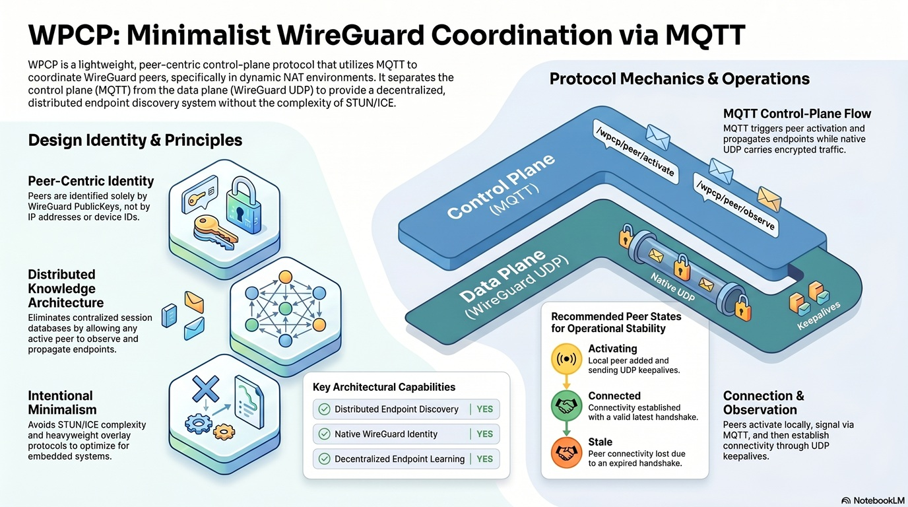

# WireGuard Peer Coordination Protocol (WPCP)

The **WPCP protocol** serves as a specialized **control plane** designed to manage **WireGuard Peers** by using **MQTT** for communication. Instead of relying on centralized databases or complex networking protocols like STUN, it uses **Distributed Endpoint Discovery** to share connection details across a network. This system facilitates **NAT traversal** by allowing peers to signal their availability and update their connection points in real time. Because the protocol keeps the **Data plane and Control plane separate**, encrypted traffic continues to flow directly between peers via **WireGuard**. Ultimately, this approach offers a **Minimalist and Peer-Centric** way to maintain secure tunnels in dynamic or restricted network environments.



- WPCP is an MQTT-based control plane for WireGuard peers.
- WireGuard still carries encrypted data over UDP directly between peers.
- WPCP only coordinates endpoint discovery and peer activation/deactivation.

## Quickstart Goal

This guide shows the simplest end-to-end Ubuntu setup for:

- One Mosquitto MQTT broker
- Peer A behind NAT
- Peer B behind NAT
- One Detector Peer on a public server

Constraints in this scenario:

- Peer A and Peer B only know each other's WireGuard public key
- Peer A and Peer B do not know each other's endpoint (IP:port)
- Peer Detector is publicly reachable and helps publish endpoint observations

## Architecture

```
					MQTT control plane (Mosquitto)
		+-----------------------------------------+
		| Broker: 12.34.56.78:1883               |
		+-----------------------------------------+
			 ^                ^                 ^
			 |                |                 |
	 +-------+        +-------+         +----------+
	 | Peer A|        | Peer B|         | Detector |
	 | NATed |        | NATed |         | Public   |
	 +-------+        +-------+         +----------+
		\_________________/
						Direct WireGuard UDP tunnel
							(after endpoint discovery)
```

## 1. Broker Setup (Mosquitto on Ubuntu Linux)

Create MQTT credentials:
```bash
sudo apt update
sudo apt install -y mosquitto
```

```bash
sudo mosquitto_passwd -c /etc/mosquitto/passwd wpcp-agent
```

Add a minimal config file `/etc/mosquitto/conf.d/wpcp.conf`:

```conf
listener 1883
allow_anonymous false
password_file /etc/mosquitto/passwd
persistence true
```

Start broker:

```bash
sudo systemctl enable --now mosquitto
sudo systemctl status mosquitto --no-pager
```

## 2. Peers Setup (WireGuard on Ubuntu Linux)

Install required packages:

```bash
sudo apt update
sudo apt install -y wireguard-tools mosquitto-clients jq coreutils openssl
```

Minimum assumptions:

- `wg0` already exists on each host and can be managed with `wg set`
- Hosts can reach MQTT broker `12.34.56.78:1883`
- Peers can handshake with endpoint detector `11.22.33.44:51820`
- Clock skew is small (NTP enabled)

## 3. Peer Identity Inputs

You need each node's WireGuard public key:

- `A_PUBKEY`: Peer A public key
- `B_PUBKEY`: Peer B public key
- `D_PUBKEY`: Detector public key

WPCP internally uses `peer_id` derived from public key.
If you want to calculate it manually, use:

```bash
echo -n "$PUBKEY" \
	| sha256sum | awk '{print $1}' \
	| xxd -r -p | head -c 16 \
	| base32 | tr 'A-Z' 'a-z' | tr -d '='
```

Store results as:

- `A_PEER_ID`
- `B_PEER_ID`
- `D_PEER_ID`

## 4. Configure Peer A and Peer B (JSON)

The WPCP agent of peer A and B use `wpcp-conf.json` to know each other's peer id and public key.
You can also use `scripts/wg-conf-to-json.sh` script to generate `wpcp-conf.json` from WireGuard config file: /etc/wireguard/*.conf

Config schema note: peer entries are under `<ifname>.peers.<peer_id>`.

### 4.1 Peer A config

Create `/etc/wpcp-conf.json` on Peer A:

```json
{
	"wg0": {
		"peers": {
			"B_PEER_ID": {
				"public_key": "B_PUBKEY",
				"allowed_ips": ["10.10.0.2/32"],
				"description": "Peer B behind NAT"
			}
		}
	}
}
```

Replace placeholders with real IDs/keys.

### 4.2 Peer B config

Create `/etc/wpcp-conf.json` on Peer B:

```json
{
	"wg0": {
		"peers": {
			"A_PEER_ID": {
				"public_key": "A_PUBKEY",
				"allowed_ips": ["10.10.0.1/32"],
				"description": "Peer A behind NAT"
			}
		}
	}
}
```

Detector is not listed in A/B JSON in this quickstart. Detector assistance is selected at runtime with `-d D_PEER_ID` in the A/B startup commands.

## 5. Start Commands

Start order is recommended as: Broker -> Detector -> Peer A -> Peer B.

### 5.1 Detector (no JSON config required)

Detector can run command-only. Example:

```bash
./wpcp-agent.sh -i wg0 -b 12.34.56.78 -e 11.22.33.44:51820 --username wpcp-agent --password jetapple --log-level debug
```

Notes:

- `-e` sets detector's own explicit public endpoint of wireguard interface (local advertised endpoint)
- Detector does not need `--config` for this quickstart

### 5.2 Peer A

```bash
./wpcp-agent.sh \
	-i wg0 \
	-b 12.34.56.78 \
	-c /etc/wpcp-conf.json \
	-a 0 \
	-d D_PEER_ID \
	--username wpcp-agent \
	--password jetapple \
	--log-level debug
```

### 5.3 Peer B

```bash
./wpcp-agent.sh \
	-i wg0 \
	-b 12.34.56.78 \
	-c /etc/wpcp-conf.json \
	-a 1 \
	-d D_PEER_ID \
	--username wpcp-agent \
	--password jetapple \
	--log-level debug
```

## 6. How A-B Direct Connectivity Is Maintained

With the above configuration, A and B maintain direct WireGuard connectivity automatically:

1. Detector continuously observes active peer endpoints from WireGuard state.
2. Detector publishes observation messages through MQTT.
3. A and B receive observations, learn each other's latest endpoint, and peer B triggers activation automatically.
4. Agent updates WireGuard peer endpoint using `wg set`.
5. New handshakes are established directly between A and B over UDP.
6. `--keepalive-active 25` helps keep NAT mappings alive.
7. If endpoint becomes stale (older than `--endpoint-timeout`), observation/activation cycle refreshes it.

In short: `wpcp-conf.json` defines who should connect, and WPCP runtime keeps endpoint details fresh.

## 7. Verification

### 7.1 Check WireGuard state

```bash
wg show wg0
```

Look for:

- `latest handshake` is recent for A<->B
- endpoint is populated for target peer

### 7.2 Check runtime cache

```bash
jq . /tmp/wpcp-wg0-cache.json
```

Look for:

- `peers.<peer_id>.state` (for example: `CONNECTED`, `ACTIVATING`, `STALE`)
- observed `endpoint.ipv4` or `endpoint.ipv6`

### 7.3 Watch MQTT activity

```bash
mosquitto_sub -h 12.34.56.78 -u wpcp-agent -P jetapple -t 'wg/peer/+/+' -v
```

You should see observation/control messages while peers are reconciling.

## 8. Troubleshooting

### A/B stays in `ACTIVATING`

- Detector may be offline or not seeing handshakes
- Check detector logs and broker connectivity
- Confirm `D_PEER_ID` in `-d` matches detector's real peer ID

### State becomes `STALE`

- Endpoint observation is outdated
- NAT mapping may have changed
- Wait for next observation, or restart detector/peers to accelerate refresh

### No messages on MQTT topics

- Verify broker address/port/credentials
- Confirm host firewall allows TCP 1883
- Run with `--log-level debug` and check errors

## 9. Important Notes

- WPCP is the control plane only; encrypted data stays on WireGuard UDP data plane.
- `-e` is not a remote peer endpoint selector. It is the local node's explicit advertised endpoint.
- For production, add MQTT TLS (`--tls 1`, `--cafile`, and optional client cert/key).

## 10. More Details

- Protocol details: `docs/wpcp.md`
- Agent behavior and cache model: `docs/openwrt-wpcp-agent.md`
- CLI reference: `scripts/wpcp-agent.sh`